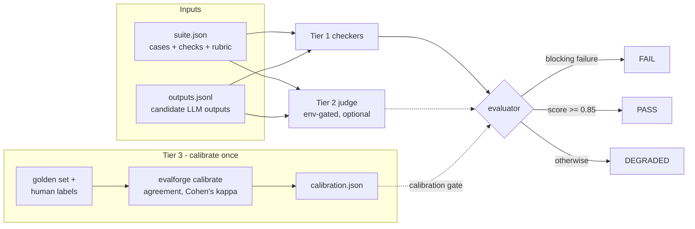

# EvalForge

**LLM output quality evaluator — deterministic checks, a calibration-gated LLM judge, and meta-evaluation ("judge the judge").**

[](https://github.com/BazanJeremy/EvalForge/actions/workflows/ci.yml)
[](tests/)
[](pyproject.toml)
[](LICENSE)

> 🇫🇷 [Version française](README.md)

**Status: ✅ Complete.** 121 tests, zero API keys required, CI gated by its own canonical scenarios (see [The CI gate](#the-ci-gate-this-repo-checks-its-own-contract)).

## The problem

Every team shipping LLM features faces the same two questions on every release: **is this model output good enough — and can we trust the thing that says so?**

The industry default — LLM-as-judge — answers the first question while ignoring the second: an unvalidated judge is a second opinion of unknown quality stacked on the first, with its known failure modes (sycophancy, verbosity bias, scale drift) left unmeasured. EvalForge treats the judge itself as a system under test: deterministic checks that cannot be compensated away, an optional LLM judge, and a meta-evaluation layer that decides — from measured agreement with human labels — whether that judge deserves a vote.

```
$ evalforge run --suite suite.json --outputs outputs.jsonl

EvalForge verdict: DEGRADED (score 0.58)

Cases:
  [warn ] BR-001  3/4 checks
  [warn ] BR-002  2/4 checks
  [warn ] BR-003  2/4 checks

Signals:
  deterministic  0.58  (weight 0.60, 12 checks)
  judge          absent (weights renormalized to deterministic-only)

Conditions:
  - case BR-001: non-blocking length check failed (length 91 below minimum 120)
  - case BR-002: non-blocking contains check failed (output does not contain 'firefox')
  ...
  - judge unavailable: score is deterministic-only
```

Exit code `1` — a CI pipeline can gate on it directly (`0` PASS, `1` DEGRADED, `2` FAIL, `3` error).

[ReleaseGuard](https://github.com/BazanJeremy/ReleaseGuard) fuses deterministic quality signals into a release verdict; EvalForge answers the next question up the stack: **how much can an LLM signal be trusted before letting it vote?** The sample datasets evaluate [TestScribe](https://github.com/BazanJeremy/testscribe)-style enriched bug reports — soft interop, no runtime coupling.

## How it works

Three tiers ([ADR-001](docs/adr/ADR-001-evaluation-model.md)), each with a distinct epistemic status:

| Tier | What | Trust status |
|---|---|---|
| **1 — deterministic checks** | `json_structure`, `contains`, `regex`, `length`, `forbidden` | Always trusted. A failed *blocking* check ⇒ `FAIL`, non-compensable |
| **2 — LLM-as-judge** | rubric-based 1–5 grading, structured output, env-gated | Trusted **only after calibration** |
| **3 — meta-evaluation** | exact + adjacent agreement, Cohen's kappa vs human labels | The layer that measures the measurer |

Three design commitments carry the model:

1. **An uncalibrated judge can never affect the verdict.** Judge scores enter the suite score only when Cohen's kappa on a human-labeled golden set reaches the policy floor (0.40, "moderate" per Landis & Koch, over ≥ 10 cases). Below it, the judge is demoted to advisory — its grades stay visible on the case results but are excluded from scoring. The gate is enforced *inside the Pydantic models*, not just in the evaluator: a `SuiteReport` carrying a judge score without a calibrated `CalibrationReport` cannot be constructed, and a `CalibrationReport` whose `calibrated` flag contradicts its own kappa is rejected at validation. The tests prove it end-to-end: with identical 5/5 grades, a calibrated judge lifts a DEGRADED suite to PASS (0.75 → 0.85) and an uncalibrated one changes nothing.
2. **A sycophantic judge fails calibration by construction.** A judge that grades everything 5/5 scores kappa = 0 — pure chance agreement — on the golden set, whose human labels deliberately span the whole 1–5 scale so agreement metrics have teeth ([test](tests/test_metrics.py)).
3. **`FAIL` requires an identifiable blocker.** The score alone only chooses between `PASS` and `DEGRADED` — low quality without a named hard defect is a degraded ship with listed risks, not a veto (the mirror of [ReleaseGuard](https://github.com/BazanJeremy/ReleaseGuard)'s "NO GO requires a blocker").

## Architecture



- Weights renormalize when the judge is absent or uncalibrated; the absence lands in the conditions list. Every number lives in [`policy.py`](src/evalforge/policy.py) — there are deliberately **no tuning flags** ([ADR-002](docs/adr/ADR-002-cli-contract.md)): the thresholds are the product's core promise, so changing one goes through a superseding ADR, not a pipeline flag.
- Failure modes degrade, never crash: a judge error falls back to deterministic-only scoring (noted as a condition), blocked cases are never graded, and a missing output is an error (exit 3), never a verdict — no evidence, no opinion.

## The CI gate: this repo checks its own contract

There is deliberately no Docker here. EvalForge's deployment story is its own CI: every push runs the 121-test suite, then executes the **installed `evalforge` binary** on the three canonical scenarios and fails the build if any exit code deviates from its committed manifest:

```bash
evalforge run --suite "$dir/suite.json" --outputs "$dir/outputs.jsonl" || got=$?
test "$got" -eq "$(manifest expected_exit)"
```

See [.github/workflows/ci.yml](.github/workflows/ci.yml). The evaluation contract is not documentation — it is executed on every push, with the verdict table published in the job summary.

## Quickstart

```bash
git clone https://github.com/BazanJeremy/EvalForge.git
cd EvalForge
python -m venv .venv
source .venv/bin/activate       # Windows PowerShell: .\.venv\Scripts\Activate.ps1
pip install -e .[dev]
python -m pytest                # 121 tests, no API key needed

# the three canonical scenarios (expected exits: 0, 2, 1)
evalforge run --suite data/samples/scenario_pass/suite.json --outputs data/samples/scenario_pass/outputs.jsonl
evalforge run --suite data/samples/scenario_fail/suite.json --outputs data/samples/scenario_fail/outputs.jsonl
evalforge run --suite data/samples/scenario_degraded/suite.json --outputs data/samples/scenario_degraded/outputs.jsonl
```

Optional Tier 2 (`pip install -e .[llm]` and set `ANTHROPIC_API_KEY`), then earn the judge its vote:

```bash
# 1. Measure the judge against the human-labeled golden set
evalforge calibrate --suite data/samples/golden/suite.json --outputs data/samples/golden/outputs.jsonl --labels data/samples/golden/labels.json --out calibration.json

# 2. Only a calibrated report lets the judge into the verdict
evalforge run --suite suite.json --outputs outputs.jsonl --calibration calibration.json
```

Everything above works identically without a key — the judge simply stays out of the verdict. A calibration report goes stale when the judge model or the rubric changes: re-run `evalforge calibrate`.

## Design decisions

| ADR | Decision |
|---|---|
| [ADR-001](docs/adr/ADR-001-evaluation-model.md) | Evaluation model: three tiers, non-compensable blocking checks, calibration-gated judge |
| [ADR-002](docs/adr/ADR-002-cli-contract.md) | CLI contract: verdict-mapped exit codes (usage errors on 3, not argparse's 2), calibration as an explicit step and durable artifact, no tuning flags |

ADR-001 also documents the build-vs-adopt decision honestly: promptfoo/deepeval were weighed and rejected *for this project* because calibration-gating the judge is not a first-class primitive there and the project's goal is demonstrating evaluation engineering from first principles — in a product team, adopting one and layering calibration on top is often the right call.

Bugs caught by the project's own tests and dogfood runs are documented in [docs/bug-evidence.md](docs/bug-evidence.md) — including the S3 review catching a `deterministic_score` ambiguity where "no checks defined" was indistinguishable from "every check failed".

## Known limitations

A tool with a deliberately reduced scope, not a product — each cut is documented and is a stated extension point, not an accident:

- 10-case golden set — a kappa over so few points is noisy; adjacent agreement is reported alongside for that reason.
- No pairwise/A-B comparison between models — and with it, no position-bias probes.
- Single reference judge implementation (Anthropic) behind a `Protocol`; no judge ensembles.
- `json_structure` (parse + required keys) rather than full JSON Schema validation.
- Not published on PyPI; editable install only.
- The build-vs-adopt call (promptfoo, deepeval) is weighed honestly in ADR-001: in a product team, adopting an existing harness and layering calibration on top is often the right call.

## Project structure

```
src/evalforge/
  models.py     # Pydantic v2 contract models; ADR-001 invariants enforced in-model
  policy.py     # every ADR-001 number, single source
  checkers.py   # Tier 1 deterministic checks
  judge.py      # Tier 2 env-gated LLM judge (LLMClient/Judge Protocols, Anthropic impl, FakeJudge)
  metrics.py    # Tier 3 meta-evaluation (agreement, Cohen's kappa, self-consistency, calibrate)
  evaluator.py  # verdict engine: blocking gates -> calibration-gated score -> PASS/DEGRADED/FAIL
  cli.py        # argparse CLI: run / calibrate, verdict-mapped exit codes (ADR-002)
data/samples/   # canonical scenarios (PASS / FAIL / DEGRADED) + human-labeled golden set
docs/adr/       # architecture decision records
docs/bug-evidence.md
tests/          # 121 tests: contracts, checkers, judge parsing, metrics, verdicts, CLI
```

## Related projects

These tools share the same principles: **deterministic first, AI where it earns its place — the QA stays the arbiter.** All run locally, no API keys required.

| Project | Focus |
|---|---|
| [EvalForge](https://github.com/BazanJeremy/EvalForge) **← this repo** | LLM evaluation & judge calibration |
| [ReleaseGuard](https://github.com/BazanJeremy/ReleaseGuard) | Explainable GO/NO-GO release gate |
| [FlakySense](https://github.com/BazanJeremy/flakysense) | Statistical flaky-test diagnosis |
| [Anomaly Sentinel](https://github.com/BazanJeremy/anomaly-sentinel) | Testing AI anomaly-detection systems (medtech · fintech) |
| [TestScribe](https://github.com/BazanJeremy/testscribe) | AI-assisted bug report enrichment |
| [SkyGuard](https://github.com/BazanJeremy/skyguard) | Security quality gate for critical avionics systems |

## Author

**Jérémy Bazan** — QA Engineer / QA Tech Lead, focused on AI-driven quality engineering.
[LinkedIn](https://www.linkedin.com/in/jeremy-bazan/) · [GitHub](https://github.com/BazanJeremy)

Licensed under the [MIT License](LICENSE).
