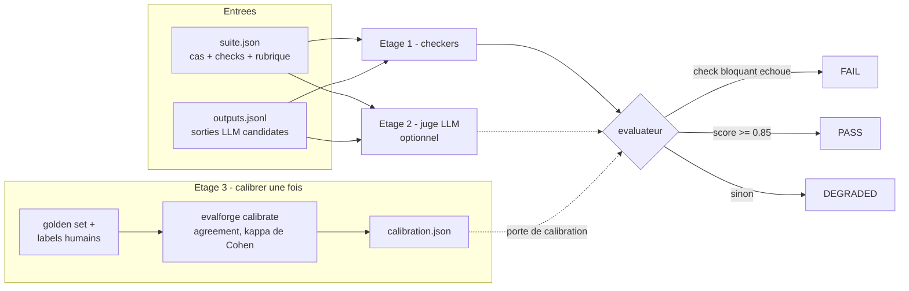

# EvalForge

**Quality gate pour systèmes LLM — checks déterministes, juge LLM sous calibration, et méta-évaluation qui « juge le juge ».**

[](https://github.com/BazanJeremy/EvalForge/actions/workflows/ci.yml)
[](tests/)
[](pyproject.toml)
[](LICENSE)

> 🇬🇧 [English version](README.en.md)

Trois rapports de bug enrichis par un LLM, évalués en une commande :

```
$ evalforge run --suite suite.json --outputs outputs.jsonl

EvalForge verdict: DEGRADED (score 0.58)

Cases:
  [warn ] BR-001  3/4 checks
  [warn ] BR-002  2/4 checks
  [warn ] BR-003  2/4 checks

Signals:
  deterministic  0.58  (weight 0.60, 12 checks)
  judge          absent (weights renormalized to deterministic-only)

Conditions:
  - case BR-001: non-blocking length check failed (length 91 below minimum 120)
  - case BR-002: non-blocking contains check failed (output does not contain 'firefox')
  ...
```

Exit code `1` — une pipeline CI peut bloquer directement dessus (`0` PASS, `1` DEGRADED, `2` FAIL, `3` erreur).

**Statut : complet.** 121 tests, zéro clé API requise, CI verrouillée par ses propres scénarios canoniques.

## Le problème

Un système LLM en production produit des sorties non déterministes : le même prompt peut donner deux réponses différentes, et « ça a l'air bon » n'est pas un critère de qualité. La réponse par défaut de l'industrie — faire noter les sorties par un second LLM (*LLM-as-judge*) — déplace le problème sans le résoudre : un juge non validé est une seconde opinion de qualité inconnue posée sur la première, avec ses défaillances documentées (sycophantie, biais de verbosité, dérive d'échelle) laissées non mesurées.

EvalForge est un framework d'évaluation LLM qui traite le juge lui-même comme un système sous test : des checks déterministes non compensables, un juge LLM optionnel, et une couche de méta-évaluation qui décide — à partir de métriques de fiabilité mesurées contre des labels humains — si ce juge mérite de voter.

[ReleaseGuard](https://github.com/BazanJeremy/ReleaseGuard) fusionne des signaux qualité déterministes en un verdict de release ; EvalForge répond à la question suivante : **à quel point peut-on faire confiance à un signal LLM avant de le laisser voter ?** Les jeux de données d'exemple évaluent des rapports de bug enrichis façon [TestScribe](https://github.com/BazanJeremy/testscribe) — interopérabilité souple, aucun couplage à l'exécution.

## Comment ça marche

| Étage | Quoi | Statut de confiance |
|---|---|---|
| **1 — checks déterministes** | `json_structure`, `contains`, `regex`, `length`, `forbidden` | Toujours fiable. Un check *bloquant* échoué ⇒ `FAIL`, non compensable |
| **2 — juge LLM** | notation 1–5 par critère de rubrique, sortie structurée, activé par l'environnement | Fiable **seulement après calibration** |
| **3 — méta-évaluation** | agreement exact + adjacent, kappa de Cohen contre labels humains | L'étage qui mesure le mesureur |

Trois engagements de conception portent le modèle ([ADR-001](docs/adr/ADR-001-evaluation-model.md)) :

1. **Un juge non calibré ne peut jamais influencer le verdict.** Ses notes n'entrent dans le score que si le kappa de Cohen sur un golden set étiqueté par un humain atteint le plancher (0.40, « modéré » selon Landis & Koch, sur au moins 10 cas). En dessous, le juge est rétrogradé en avis consultatif : ses notes restent visibles sur les résultats, mais sont exclues du score. L'invariant est verrouillé *dans les modèles Pydantic*, pas seulement dans l'évaluateur — un rapport qui le viole ne peut pas être construit.
2. **Un juge sycophante échoue la calibration par construction.** Un juge qui note tout 5/5 obtient un kappa de 0 — accord dû au seul hasard — sur le golden set, dont les labels humains couvrent délibérément toute l'échelle 1–5.
3. **`FAIL` exige un défaut identifiable.** Le score seul ne choisit qu'entre `PASS` et `DEGRADED` : une qualité moyenne sans défaut bloquant nommé est une livraison dégradée avec risques listés, pas un veto.

Score : `0.6 × taux de passage déterministe + 0.4 × qualité juge`. Les poids se renormalisent quand le juge est absent ou non calibré, et cette absence est tracée dans les conditions du rapport. Tous les seuils vivent dans [`policy.py`](src/evalforge/policy.py) — aucun flag de réglage ([ADR-002](docs/adr/ADR-002-cli-contract.md)) : un seuil ne change que par un ADR qui remplace le précédent.

## Architecture



## Un cas d'évaluation type

La suite déclare, par cas, des checks déterministes et une rubrique pour le juge. Extrait du scénario canonique (enrichissement de rapports de bug — le premier cas vient du medtech) :

```json
{
  "id": "BR-001",
  "input": "Raw bug report: The infusion pump alarm doesn't sound when the IV line is blocked.",
  "checks": [
    {"type": "json_structure", "required_keys": ["title", "severity", "reproduction_steps"], "blocking": true},
    {"type": "forbidden", "values": ["as an ai", "lorem ipsum"], "blocking": true},
    {"type": "contains", "value": "alarm"},
    {"type": "length", "min_chars": 120, "max_chars": 2000}
  ]
}
```

Lecture : une sortie sans JSON valide ou contenant du contenu interdit est un défaut dur — verdict `FAIL`, quel que soit le reste. Une sortie trop courte ou qui omet le mot-clé dégrade le score sans le mettre à zéro. La rubrique (correctness, completeness, clarity) est notée 1–5 par le juge — si, et seulement si, ce juge a prouvé son accord avec un évaluateur humain.

## Démarrage rapide

```bash
git clone https://github.com/BazanJeremy/EvalForge.git
cd EvalForge
python -m venv .venv
source .venv/bin/activate       # Windows PowerShell : .\.venv\Scripts\Activate.ps1
pip install -e .[dev]
python -m pytest                # 121 tests, aucune clé API requise

# les trois scénarios canoniques (exit codes attendus : 0, 2, 1)
evalforge run --suite data/samples/scenario_pass/suite.json --outputs data/samples/scenario_pass/outputs.jsonl
evalforge run --suite data/samples/scenario_fail/suite.json --outputs data/samples/scenario_fail/outputs.jsonl
evalforge run --suite data/samples/scenario_degraded/suite.json --outputs data/samples/scenario_degraded/outputs.jsonl
```

Étage 2 optionnel (`pip install -e .[llm]` + `ANTHROPIC_API_KEY`), puis le juge doit gagner son droit de vote :

```bash
# 1. Mesurer le juge contre le golden set étiqueté humain
evalforge calibrate --suite data/samples/golden/suite.json --outputs data/samples/golden/outputs.jsonl --labels data/samples/golden/labels.json --out calibration.json

# 2. Seul un rapport calibré fait entrer le juge dans le verdict
evalforge run --suite suite.json --outputs outputs.jsonl --calibration calibration.json
```

Tout fonctionne à l'identique sans clé — le juge reste simplement hors du verdict. Un rapport de calibration devient obsolète quand le modèle du juge ou la rubrique change : relancer `evalforge calibrate`.

## Décisions de conception

- **Python ≥ 3.12, Pydantic v2** pour tous les contrats de données — les invariants du verdict sont des validateurs de modèle, pas des conventions.
- **pytest + coverage** : 121 tests (contrats, checkers, parsing du juge, métriques, verdicts de bout en bout, CLI), tous exécutables sans clé API.
- **`anthropic` en dépendance optionnelle** derrière un `Protocol` — les tests utilisent un `FakeJudge` scripté.
- **Métriques sans scipy ni sklearn** : les formules (kappa de Cohen, agreements) sont petites, possédées et auditables.
- **CI GitHub Actions zéro clé** qui exécute le binaire `evalforge` installé contre les trois scénarios canoniques et casse le build si un exit code dévie de son manifeste — le contrat d'évaluation est exécuté à chaque push, pas seulement documenté.
- Décisions d'architecture tracées : [ADR-001](docs/adr/ADR-001-evaluation-model.md) (modèle d'évaluation), [ADR-002](docs/adr/ADR-002-cli-contract.md) (contrat CLI). Les bugs attrapés par les propres tests du projet sont documentés dans [docs/bug-evidence.md](docs/bug-evidence.md).

## Limites connues

Un outil au périmètre volontairement réduit, pas un produit : chaque coupe est documentée.

- Golden set de 10 cas — un kappa sur si peu de points est bruité ; l'agreement adjacent est rapporté à côté pour cette raison.
- Pas de comparaison par paires (A/B) entre modèles, donc pas de sondes de biais de position — point d'extension déclaré.
- Un seul juge de référence (Anthropic) derrière un `Protocol` ; pas d'ensembles de juges.
- `json_structure` (parsing + clés requises) plutôt qu'une validation JSON Schema complète.
- Non publié sur PyPI ; installation en mode éditable uniquement.
- Le choix de construire plutôt qu'adopter (promptfoo, deepeval) est pesé honnêtement dans ADR-001 : dans une équipe produit, adopter un harnais existant et poser la calibration par-dessus est souvent le bon appel.

## Projets associés

Ces outils partagent les mêmes principes : **le déterministe d'abord, l'IA là où elle apporte — le QA reste l'arbitre.** Tous tournent en local, aucune clé API requise.

| Projet | Focus |
|---|---|
| [EvalForge](https://github.com/BazanJeremy/EvalForge) **← ce repo** | Évaluation de LLM & calibration du juge |
| [ReleaseGuard](https://github.com/BazanJeremy/ReleaseGuard) | Verrou de release GO/NO-GO explicable |
| [FlakySense](https://github.com/BazanJeremy/flakysense) | Diagnostic statistique des tests flaky |
| [Anomaly Sentinel](https://github.com/BazanJeremy/anomaly-sentinel) | Tester les IA de détection d'anomalies (medtech · fintech) |
| [TestScribe](https://github.com/BazanJeremy/testscribe) | Enrichissement de bug reports assisté par IA |
| [SkyGuard](https://github.com/BazanJeremy/skyguard) | Quality gate sécurité pour systèmes critiques avioniques |

## Auteur

**Jérémy Bazan** — Ingénieur QA / Lead Tech QA, orienté qualité des systèmes IA.
[LinkedIn](https://www.linkedin.com/in/jeremy-bazan/) · [GitHub](https://github.com/BazanJeremy)

Distribué sous [licence MIT](LICENSE).
